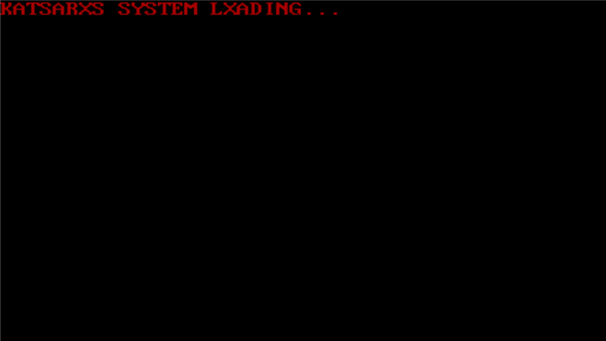

# Bootloader

## Introduction
Welcome to my **Custom Bootloader**! This is a simple (yet difficult) very small bootloader which just prints a text on the screen (for now). It's written in low level NASM assembly language [](#)
### Why?
The motive was to understand what happens inside the computer when we boot, how and why we instruct the machine to execute certain commands. To get a glipse how well-known bootloaders work, how the boot and appear on the screen and how they boot later the operating system we are working on.
### To-Do Features

- **Kernel**: Create my own kernel that boots from the bootloader.
- **Mini Os**: Create and finalize a very simple, small and command-line based OS (long way to go...)

## Photo of the Bootloader



## Table of Contents

1. [Introduction](#introduction)
   - [Why?](#why?)
   - [To-Do Features](#to-do-features)
2. [Usage](#usage)
   - [Machine Emulator](#machine-emulator)
   - [Bootable Device](#bootable-device)
3. [License](#license)
4. [Contact](#contact)
## Usage
There are 2 options
- Run the program on machine emulator (I prefer QEMU which is open-source)
- Make a bootable device and run it physically on your computer


### Machine Emulator
#### Windows
1. Download QEMU setup and follow the instuctions to install from [here](https://www.qemu.org/download/#windows).
###### Now if you want to run it immediatly, download the `bootloader.bin` file from my repository and jump to step 5. Or else, continue.
2. Download NASM setup and follow the instructions to install from here [here](https://www.nasm.us/pub/nasm/releasebuilds/2.16.03/).
3. Download the `bootloader.asm` file from my repository. Locate the folder where `qemu-system-x86_64.exe` file is and put the `bootloader.asm` and  `nasm.exe` files there.
4. Open the Command Prompt and navigate to the folder. Run the following command to assemble the .asm file into binary file :
```bash
nasm -f bin bootloader.asm -o bootloader.bin
```
5. In order to boot it on QEMU, run the following command :
```bash
qemu-system-x86_64 -drive format=raw,file=bootloader.bin
```

#### Debian-Based Linux
1. Run the following command for APT :
```bash
sudo apt update && sudo apt upgrade
```
2. Download and install QEMU using the commands : 
```bash
sudo apt install qemu-system
```
###### Now again, if you want to run it immediatly, download the `bootloader.bin` file from my repository and jump to step 6. Or else, continue
3. Download and install NASM using the command : 
```bash
sudo apt install nasm
```
4. Download the `bootloader.asm` file form my repository.
5. Run the following command to assemble the .asm file into binary file : 
```bash
nasm -f bin bootloader.asm -o bootloader.bin
```
6. In order to boot it on QEMU, run the following command :
```bash
qemu-system-x86_64 -drive format=raw,file=bootloader.bin
```
### Bootable Device
#### Windows
I haven't researched yet...
#### Debian-Based Linux
1. Follow all the previous steps we did except downlaoding QEMU.
2. Insert your USB stick and execute the command :
```bash
sudo fdisk -l
```
3. In the output message, locate your USB's path (ex: `/dev/sdc`). Execute the following command to write the bootloader to the device :
##### ! THE DATA WILL BE ERASED, WARNING !
```bash
sudo dd if=bootloader.bin of={path}
```
4. Now restart your computer, press F12 (or it depends) repeatedly. In the BOOR menu, go to USB Storage Device and press ENTER.
## License
My project follows the MIT license, I support strongly open-source coding. [](https://opensource.org/licenses/MIT)
## Contact
[](https://www.linkedin.com/in/%CE%BD%CE%B9%CE%BA%CF%8C%CE%BB%CE%B1%CE%BF%CF%82-%CE%BA%CE%B1%CF%84%CF%83%CE%B1%CF%81%CF%8C%CF%82-39750b274/)
[](http://www.instagram.com/katsarxs_)